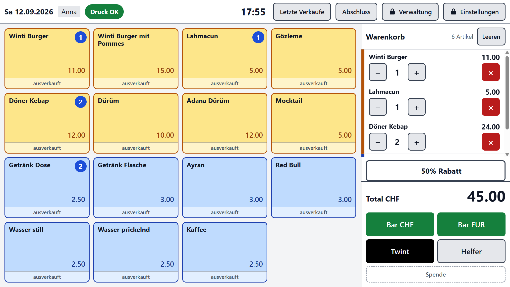
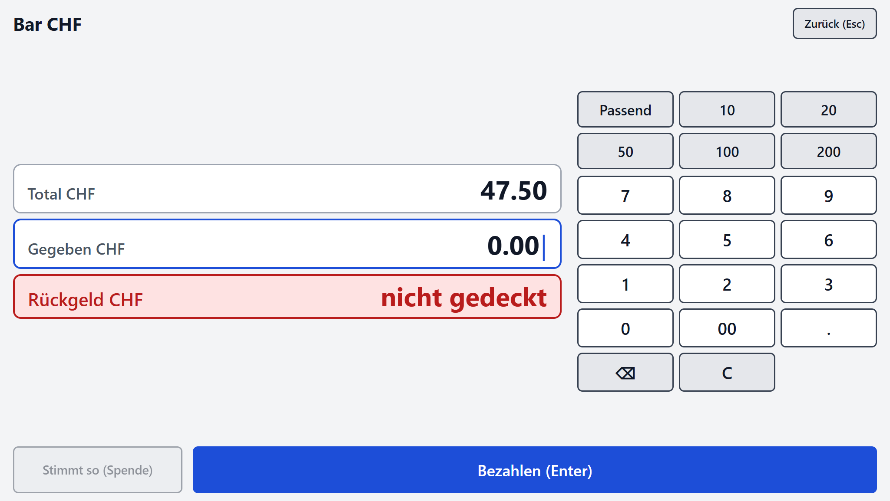
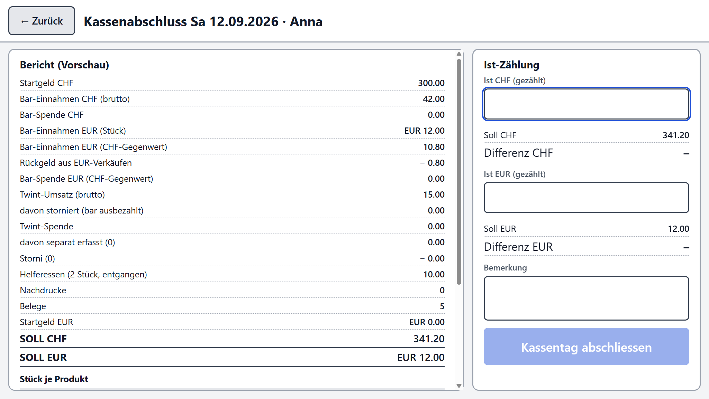
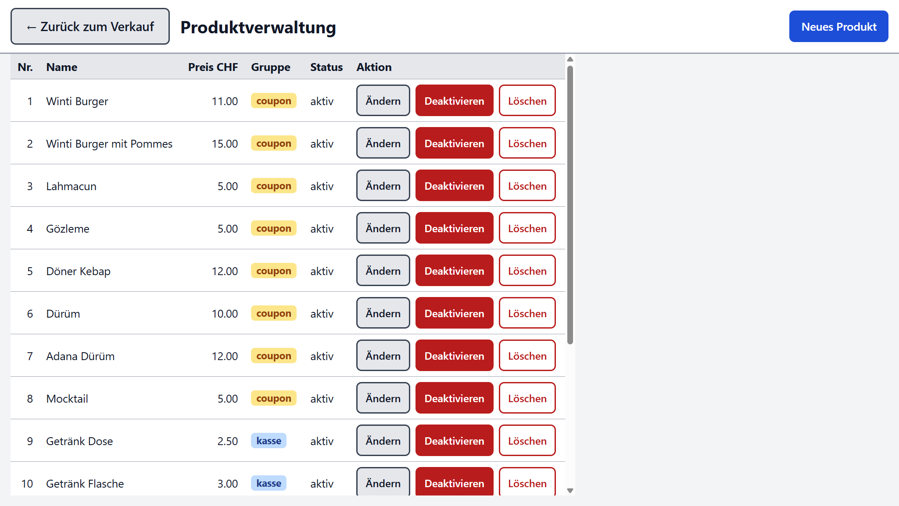

# Kasse für Vereinsfeste

Eine lokale Kassensoftware für Verpflegungsstände an Vereinsfesten: ein Kassierpunkt, Produktkacheln auf dem Bildschirm, Bar- und Twint-Zahlung, Abholcoupons und Bon vom Bondrucker, Kassentag mit Startgeld und Abschluss mit Ist-Zählung. Sie läuft vollständig offline auf einem Windows-Rechner; alle Daten liegen in einer SQLite-Datei auf demselben Gerät. Entstanden ist sie für ein zweitägiges Vereinsfest in der Schweiz und ist deshalb auf Schweizer Verhältnisse zugeschnitten. Der Code steht unter der MIT-Lizenz; andere Vereine können die Kasse installieren, ihre eigenen Produkte einpflegen und den Code anpassen.

## Was sie kann

- **Verkaufen:** grosse Produktkacheln, Warenkorb mit +/−/Löschen, erneutes Antippen erhöht die Menge, Ausverkauft-Schalter direkt auf der Kachel (ohne PIN).
- **Bar CHF:** Ziffernblock auf dem Bildschirm plus Schnellwahl (Passend, 10, 20, 50, 100, 200), drei Zeilen Total / Gegeben / Rückgeld mit dem Rückgeld am grössten. Bedienbar per Maus, Touch und Tastatur (Ziffern, Punkt/Komma, Backspace, Enter, Esc).
- **Bar EUR:** Euro-Annahme mit eigenem, in den Einstellungen gepflegtem Kurs. Der Kurs wird pro Beleg gespeichert, der CHF-Gegenwert des gegebenen Betrags auf 5 Rappen abgerundet, das **Rückgeld immer in CHF** ausgezahlt. Der Bildschirm zeigt zusätzlich «Total in EUR» (auf 0.10 EUR aufgerundet), damit der Kassier den Betrag nennen kann.
- **Twint:** statischer QR-Code am Stand, der Kunde tippt den Betrag selbst, der Kassier prüft die Bestätigung auf dem Kundenhandy und bestätigt mit einem Tipp. Das Betragsfeld ist mit dem Total vorbelegt; eine Überzahlung wird als Twint-Spende gebucht, es gibt kein Rückgeld.
- **Helfer/Gratis:** Beleg über 0 CHF, Coupons werden trotzdem gedruckt, die Stückzahlen erscheinen im Abschluss als Helferessen und nie als Umsatz.
- **Spenden:** «stimmt so» bucht das Rückgeld als Spende. Separate Spenden (zu einem bereits gespeicherten Bar-Beleg oder ganz ohne Kauf) lassen sich nachträglich erfassen, ohne Bon und ohne Schubladenimpuls.
- **Schweizer Eigenheiten:** Preise sind auf 5 Rappen definiert, gerundet wird nur beim EUR-Gegenwert, nie auf einzelnen Positionen. Alle Beträge werden intern als ganze Rappen gerechnet, nie als Fliesskommazahl. **Keine Mehrwertsteuer** – es gibt keine MwSt-Felder und keine MwSt-Zeilen auf dem Bon.
- **Drucken:** pro Verkauf ein Druckauftrag mit Schubladenimpuls (nur bei Bar), einem Abholcoupon je Produktzeile der Gruppe `coupon` (Anzahl und Produktname gross, Datum, Uhrzeit, Belegnummer, «Coupon n/m») und dem Bon. Produkte der Gruppe `kasse` erscheinen nach dem Bezahlen auf dem Bildschirm als «Sofort ausgeben». Der Verkauf ist gespeichert, bevor irgendetwas gedruckt wird.
- **Nachdruck und Storno:** Nachdruck des letzten Belegs (alles / nur Coupons / nur Bon) mit Aufdruck NACHDRUCK; Storno immer des ganzen Belegs mit Pflichtgrund als Gegenbuchung – der letzte Beleg ohne PIN, ältere mit PIN.
- **Kassentag:** Start mit Startgeld CHF (und optional EUR) und Kassier-Kürzel, Wiederaufnahme nach Absturz oder Neustart samt halbfertigem Warenkorb, Warnung bei nicht abgeschlossenem Vortag.
- **Kassenabschluss:** Soll/Ist/Differenz für CHF und EUR, Stück und Umsatz je Produkt (Verkauf und Helfer getrennt), Kassier und Unterschriftslinie – als Bon und als PDF im Archivordner.
- **Produktverwaltung hinter PIN:** Name (max. 24 Zeichen), Preis, Gruppe (`coupon` / `kasse`), Reihenfolge, aktiv/inaktiv. Verkaufte Produkte werden deaktiviert statt gelöscht; jede Position speichert Name und Preis zum Verkaufszeitpunkt.
- **Robust im Betrieb:** Kiosk-Vollbild, Beenden nur mit Ctrl+Shift+Q und PIN, Single-Instance-Sperre, Bildschirm bleibt an. Ein Druckerausfall blockiert die Kasse nicht: sie zeigt «Drucker prüfen» und die von Hand zu schreibenden Coupons. Hängende Spooler-Aufträge werden entfernt, es wird nie automatisch nachgedruckt.
- **Backup:** Kopie der Datenbank alle 10 Minuten, bei jedem Abschluss und beim Beenden, lokal und – falls eingerichtet – zusätzlich auf einen USB-Stick.

### Was sie nicht kann

- Keine Kartenzahlung (keine Debit-/Kreditkarte, kein Terminal).
- Keine Cloud, kein Konto, keine Internetverbindung – und kein Zugriff von aussen.
- Keine Mehrwertsteuer-Abrechnung, kein CSV-Export, kein Buchhaltungs-Import.
- Nur **ein Kassierpunkt**: eine Single-Instance-Sperre lässt die Kasse nur einmal laufen, es gibt keine zweite Kasse und kein Tablet als Zweitgerät.
- Nur Windows (Kiosk, Druckweg und Einrichtungsskripte sind auf Windows ausgelegt).
- Keine Mischzahlung (eine Zahlart pro Beleg), keine Rabatte, kein Teilstorno.

## Bildschirmfotos


Verkaufsbildschirm mit Produktkacheln links, Warenkorb und Zahlartenleiste rechts.


Bezahldialog mit Ziffernblock, Schnellwahl und den drei Zeilen Total, Gegeben und Rückgeld.


Kassenabschluss mit Soll, Ist-Zählung und Differenz für CHF und EUR.


Produktverwaltung hinter der PIN: Name, Preis, Gruppe, Reihenfolge und aktiv/inaktiv.

## Hardware

Nötig:

- Ein Rechner mit Windows 10 oder 11.
- Maus und Tastatur oder ein Touchscreen. Die Oberfläche ist für beides ausgelegt (Kacheln ≥ 72 px, Knöpfe ≥ 48 px); der Bezahldialog lässt sich vollständig über die Tastatur bedienen.

Optional:

- Ein ESC/POS-Bondrucker für 80-mm-Rollen mit USB-Anschluss. Getestet ist die Epson TM-T20II.
- Eine Kassenschublade für **24 V** am DK-Anschluss des Druckers (RJ12). 12-V-Schubladen sind nicht geeignet.
- Thermorollen 80 mm breit (79.5 ± 0.5), Durchmesser bis 83 mm, Kern 12 oder 18 mm. Verwendet werden 80 × 80 × 12 mm.

**Ohne Drucker läuft alles** – Verkauf, Storno, Kassentag und Abschluss funktionieren unverändert, es werden nur keine Bons und Coupons gedruckt. Wer den Druckweg ohne Gerät ausprobieren will, startet die Kasse mit `KASSE_PRINT=sim`: der Simulator schreibt jeden Auftrag als Bytes-Datei und als lesbare Textvorschau nach `<Datenordner>\archiv\simulator\` und die Ampel in der Kopfzeile trägt den Zusatz «SIM».

## Installation

### Weg A: Fertiges Paket

1. Auf der [Releases-Seite](https://github.com/EmreBallas/kirmes-kasse/releases) die ZIP-Datei herunterladen.
2. Entpacken, zum Beispiel nach `C:\Kasse`.
3. `Kasse.exe` starten.

Die Datei ist nicht signiert. Windows SmartScreen meldet deshalb beim ersten Start «Der Computer wurde durch Windows geschützt». Über «Weitere Informationen» → «Trotzdem ausführen» startet die Kasse.

### Weg B: Selber bauen

Voraussetzungen: Node.js 24 oder neuer und Git. (`node:sqlite` läuft erst ab Node 24 ohne zusätzlichen Schalter; darauf setzen Server und Tests auf.)

```bash
git clone https://github.com/EmreBallas/kirmes-kasse.git
cd kirmes-kasse/kasse
npm install
npm run build
npm run paket
```

Das Ergebnis liegt in `kasse/dist/win-unpacked`; gestartet wird es über `Kasse.exe` in diesem Ordner. Der Ordner kann als Ganzes kopiert werden, zum Beispiel nach `C:\Kasse`.

Weitere Befehle:

- `npm run dev` – Entwicklungsmodus mit Hot Reload (nutzt den Datenordner `./data` und standardmässig den Druck-Simulator).
- `npm test` – alle vitest-Tests.
- `npm run typecheck` – TypeScript-Prüfung (Node- und Web-Konfiguration).
- `npm run build:win` – Build inklusive ZIP-Datei für eine Veröffentlichung.

## Drucker einrichten

Es wird **keine Herstellersoftware** benötigt und sollte auch keine installiert werden: die Kasse schreibt ESC/POS-Bytes als RAW-Auftrag über den Windows-Spooler. Nötig ist nur eine Windows-Druckerwarteschlange mit dem mitgelieferten Treiber «Generic / Text Only» auf dem USB-Port des Druckers.

PowerShell als Administrator:

```powershell
Get-PrinterPort | Where-Object Name -like 'USB*'
Add-Printer -Name "TM-T20II" -DriverName "Generic / Text Only" -PortName "USB001"
Get-Printer -Name "TM-T20II" | Format-List Name, DriverName, PortName, PrinterStatus
```

- Der **Name der Warteschlange muss mit der Einstellung «Druckername» in der Kasse übereinstimmen** (Standard: `TM-T20II`). Stimmt er nicht, zeigt die Ampel in der Kopfzeile «Drucker prüfen».
- Hat Windows den Drucker an einen anderen Port gehängt, den ermittelten Port statt `USB001` eintragen (`Set-Printer -Name "TM-T20II" -PortName "USB002"`).
- Der Testdruck läuft über die Einstellungen der Kasse (Knopf «Testdruck»). Auf dem Papier müssen Umlaute und türkische Zeichen korrekt erscheinen; die verwendete Codepage PC857 deckt deutsche und türkische Zeichen ab.
- `kasse/tools/setup-laptop.ps1` erledigt die Einrichtung eines Kassengeräts in einem Lauf: Warteschlange anlegen (falls sie fehlt), Energieoptionen setzen (Bildschirm, Standby und Ruhezustand aus, selektives USB-Energiesparen deaktiviert), Autostart-Verknüpfung auf `C:\Kasse\Kasse.exe` und Windows-Update pausieren. Das Skript braucht Administratorrechte:

```powershell
powershell -NoProfile -ExecutionPolicy Bypass -File kasse\tools\setup-laptop.ps1
```

Details, Belegung des DK-Anschlusses und eine Fehlertabelle stehen in `docs/drucker-setup.md`.

## Erste Schritte

1. **PIN ändern.** Beim ersten Start ist die PIN `0000`. Sie schützt Produktverwaltung, Einstellungen, Storno älterer Belege und das Beenden der Kasse – deshalb sofort in den Einstellungen auf eine eigene PIN (4 bis 8 Ziffern) ändern.
2. **Produkte einrichten.** Entweder in der Produktverwaltung anlegen und ändern, oder vor dem allerersten Start die Produkt-Seed-Datei anpassen: im Quellcode `kasse/resources/produkte-seed.json`, im entpackten Paket `resources\resources\produkte-seed.json` neben `Kasse.exe`. Sie wird nur eingelesen, solange die Produkttabelle leer ist. Felder je Eintrag:
   - `name` – Anzeigename, maximal 24 Zeichen, damit er doppelt breit auf den Coupon passt.
   - `preis_rappen` – Preis in **ganzen Rappen** (`1100` = 11.00 CHF), auf 5 Rappen definiert.
   - `gruppe` – `coupon` für alles, was an einer Ausgabe abgeholt wird (es wird ein Abholcoupon gedruckt), `kasse` für alles, was sofort über die Theke geht (erscheint nach dem Bezahlen unter «Sofort ausgeben»).
   - `reihenfolge` – Position der Kachel auf dem Verkaufsbildschirm, 1 ist oben.
3. **Einstellungen prüfen.** EUR-Kurs (Standard 0.90, gespeichert als `eurKursX10000` = 9000) und Kassen-Präfix für die Belegnummern (Standard `K1`, Belege heissen dann `K1-0001`, `K1-0002`, …).
4. **Kassentag starten.** Kassier-Kürzel und Startgeld in der Kasse erfassen (CHF, bei Bedarf zusätzlich EUR). Erst danach ist der Verkaufsbildschirm erreichbar.
5. **Am Ende abschliessen.** Kasse zählen, Ist-Beträge für CHF und EUR eingeben, Differenz prüfen, abschliessen. Der Abschluss wird als Bon gedruckt und als PDF im Archivordner abgelegt.

## Wo die Daten liegen

Im gepackten Betrieb ist der Datenordner `C:\Kasse\data` (im Entwicklungsmodus `./data` im Projektordner):

| Datei / Ordner | Inhalt |
|---|---|
| `kasse.sqlite` | die Datenbank: Produkte, Kassentage, Verkäufe, Zahlungen, Storni, Spenden, Einstellungen |
| `archiv\` | Abschluss-PDF je Kassentag (`Kassenabschluss_<Datum>_<Präfix>.pdf`), dazu `simulator\` im Simulator-Betrieb |
| `backup\` | Kopien der Datenbank: alle 10 Minuten, bei jedem Abschluss und beim Beenden |
| `bytes\` | die erzeugten Druckdaten je Auftrag |
| `kasse.log` | Protokoll von Start, Druck, Backup und Fehlern |

Der Ordner lässt sich über die Umgebungsvariable `KASSE_DATEN` verschieben, zum Beispiel auf ein anderes Laufwerk.

| Variable | Wirkung |
|---|---|
| `KASSE_DATEN` | absoluter Pfad des Datenordners; ohne die Variable `C:\Kasse\data` (gepackt) bzw. `./data` (Entwicklung) |
| `KASSE_PORT` | Port des lokalen HTTP-Servers auf `127.0.0.1`; überschreibt die Einstellung (Standard 47100) |
| `KASSE_PRINT` | `sim` erzwingt den Druck-Simulator (Dateien statt Papier), `winspool` erzwingt den echten Druck über den Windows-Spooler |
| `KASSE_KIOSK` | `0` startet das Fenster ohne Vollbild-Kiosk, auch im gepackten Betrieb (praktisch zum Einrichten) |

Zusätzlich kennt die Kasse die Einstellung `backup_pfad_usb`: ist dort ein erreichbarer Pfad hinterlegt (zum Beispiel ein USB-Stick), geht jedes Backup auch dorthin. Die Oberfläche bietet dafür bisher kein Feld; der Wert wird über `PUT /api/einstellungen` oder beim ersten Start über eine eigene `seed.local.json` neben `Kasse.exe` gesetzt.

## Anpassen für das eigene Fest

Ohne Codeänderung lassen sich Produkte, Preise, Gruppen, Reihenfolge, EUR-Kurs, Kassen-Präfix, PIN, Druckername und Backup-Pfad einstellen.

Währung und Beschriftungen sind fest auf Schweizer Verhältnisse ausgelegt: CHF ist die Hauptwährung, EUR ist die Fremdwährung, Rückgeld gibt es immer in CHF, und die Zahlarten sind Bar CHF, Bar EUR, Twint und Helfer. Wer EUR als Hauptwährung führen oder andere Zahlarten anbieten will, muss Code anpassen:

- `kasse/src/core/zahlung.ts` – Zahlarten, Rückgeld-, Spenden- und Schutzregeln (dazu `kasse/src/core/geld.ts` für Formatierung, 5-Rappen-Rundung und Umrechnung).
- `kasse/src/core/bon.ts` – Aufbau von Coupon, Bon und Abschluss-Bon, inklusive der Währungstexte.
- `kasse/src/renderer` – Beschriftungen und Bildschirme, insbesondere `components/Bezahldialog.tsx` und `components/Verkauf.tsx`.

Zwei Grenzen sind fix im Schema verankert: Produktnamen sind auf **24 Zeichen** begrenzt (länger passt der Name nicht doppelt breit auf den Coupon), und der Bon ist auf 80-mm-Papier mit 48 Zeichen je Zeile ausgelegt.

## Mitmachen und Entwicklung

Ordnerstruktur unter `kasse/src`:

- `core/` – reine Geldlogik in TypeScript, ohne Node- und DOM-Zugriff: Rundung, Rückgeld, Warenkorb, Abschluss-Aggregation, Bon-Modell.
- `print/` – Bon-Modell zu ESC/POS-Bytes, Transport über den Windows-Spooler oder den Simulator, Druck-Worker.
- `server/` – SQLite über `node:sqlite`, nummerierte Migrationen, Repositories, Hono-Routen unter `/api`, Seeds.
- `renderer/` – React-Oberfläche; sie spricht ausschliesslich HTTP mit dem lokalen Server, kein IPC.
- `main/` – Electron-Main: startet Server und Druck-Worker, Kiosk-Fenster, Backup-Timer, Abschluss-PDF.

Verbindliche Schnittstellen – Module, Datenmodell, alle API-Routen und der Druckpfad – stehen in `kasse/KONTRAKT.md`. Wer etwas ändert, hält sich an diese Beschreibung oder passt sie mit an.

```bash
npm test          # vitest
npm run typecheck # TypeScript strict, Node- und Web-Projekt
npm run dev       # Entwicklungsmodus
```

Wichtigste Regel für Beiträge: **alle Geldbeträge werden als ganze Rappen gerechnet** (EUR als ganze Cent, der Kurs als `kurs_x10000`). Fliesskommazahlen haben in Geldrechnungen nichts zu suchen. Jedes Modul bringt seine Tests als `*.test.ts` neben dem Code mit.

## Hintergrund und Dokumentation

- `docs/roadmap-v1.md` – Funktionsumfang, Architektur, Datenmodell, Fachregeln und Testplan.
- `docs/entscheidungen.md` – Entscheidungsprotokoll: was aus welchem Grund so und nicht anders gebaut wurde.
- `docs/drucker-setup.md` – Drucker, Codepage, Kassenschublade, Papier und Fehlerbehebung im Detail.

Die Software wurde zusammen mit Claude Code entwickelt; die Dokumente in `docs/` zeigen den Entscheidungsweg von der Roadmap über die Entscheide bis zu den Fachregeln und sind der beste Einstieg, wenn etwas im Code erklärungsbedürftig wirkt.

## Lizenz

MIT – siehe `LICENSE`.
